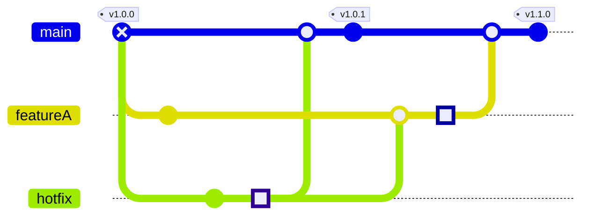

# あくまでtemplateです。本templateをもとに各repositoryでContributionのruleを作ってください。

# Contribution Guide

活動するにあたり、commitの精度が人によってまちまちになるのを防ぐための指針です。

## documentの修正

Issueの追加は任意です。
- 手順書
  - ******に記載します
- 要件・仕様
  - ******に記載します。
  - group外のmemberと共有する場合は必要に応じてConfluence上に転記します。
- 議事録
  - Scrapbox「[議事録名](議事録URL)」に記載します。

## codeの修正

以下のflow通過を原則とします。Issue作成時の各入力項目を満たせない場合は、先ずはmilestoneにてCard化を検討してください。

1. Issueの作成
1. PullRequestの作成
1. Review後のmerge

## Issueの作成

- 先ずは同等のIssueが既に存在するか確認します。
- 1つのIssueに複数の要素を入れると作業期間が長期化します。関連する要素であれば、大枠としてmilestoneの作成を検討してください。

### Issueの運用

- 着手したIssueに担当者を割り当てておきます。
- ToDo追記はchecklistにて見落とし防止で追記日付込で本文に記載しておきます。
- 別の問題が発生した場合は、内容と背景、当該Issue内で解決可能か見込みを立てて記載しておきます。

## Pull-Requestの作成

- 先にIssue作成を完了しておきます。
- 作業branch名をtitleにしたまま作成はしないでください。
- 動作確認完了前はDraftにします。
- Review時の可読性をあげるため、誤字脱字修正のcommitは極力rebaseでsquashかfixupをしておきます。
- mergeと同時にcloseさせたいIssueがある場合は、忘れずに`fix #<Issue Index>`と記載します。

### Pull-Requestの運用

- code変更目的のsnipetは、経緯や可読性を重視して極力IssueではなくPullRequest側に追記してください。
- 変更内容や動作確認項目の追加は見落としを防ぐために必ず本文修正にて行ってください。
- code変更の根拠として状況調査や検証を掲載する場合、長文となりやすいためIssue側に追記した上でPullRequest側へcomment linkの形で行います。
- masterbranchでmerge発生時は、作業branch側で逐次 `git pull --rebase origin master` を行ってください。差分が多くなりReview時の負担が増えます。

## Review

### review前にやること

- 開発環境でCI/CD・動作確認を完了させます。
- PRのscopeが適切か再確認します。
  - 機能追加と同時に大幅なrefactoringを行うと変更量が多くなります。機能追加・refactoringそれぞれで分割PRによる対応を検討してください。

### review後にやること

- Squash and Merge でmergeします。
- 作業branchを削除します。
